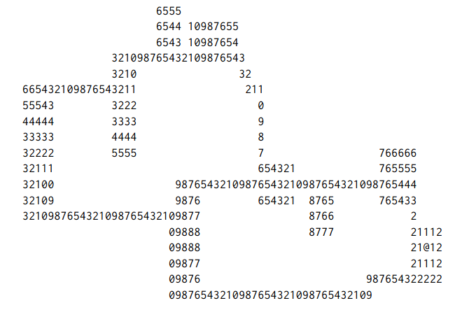

# COM S 3270, Spring 2025
## Programming Project 1.03: Path Finding

So far, we’ve got this lovely dungeon. And we can... save and restore it. And, you know... look at it.

And that’s about it. Nice for mom’s fridge, but otherwise kind of boring. Once you have monsters (next week), they (at least the smart ones) will need to find a path to the player through the dungeon. To find that path, you’ll need to implement a path-finding algorithm. We’re going to have some monsters that can tunnel through walls and others that can only move through open space, so we’ll actually need two slightly different pathfinding algorithms. In both cases we’ll use Dijkstra’s Algorithm, treating each cell in the dungeon as a node in a graph with (up to) 8-way connectivity (diagonal movement is allowed!). For the non-tunneling monsters, we’ll give a weight of 1 for floor (stairs are treated like floor for the purposes of pathfinding and character movement) and ignore wall cells (i.e., don’t try to find paths through walls; this actually degenerates to BFS, and you’re welcome to use that, but we will not require you to implement two different–if very similar–algorithms for this assignment). For the tunnelers, we’ll have to use weights based on the hardness; cells with a hardness of 0 have a weight of 1, and cells with hardnesses in the ranges [1, 254] have weights of 1 + (hardness / 85). A hardness of 255 has infinite weight. We don’t have to assign a value to this. Instead, we simply do not put it in the queue. 

A na¨ıve implementation will call pathfinding for every monster in the dungeon, but in practice, every monster is trying to get to the same place, so rather than calculating paths from the monsters to the player character (PC), we can instead calculate the distance from the PC to every point in the dungeon, and this only needs to be updated when the PC moves or the dungeon changes. Each monster will choose to move to the neighboring cell with the lowest distance to PC. This is gradient descent; the monsters move “downhill”. Unless the monster is already collocated with the PC, there is always at least one cell with a shorter distance than its current cell. In the case of multiple downhill cells having the same distance, the monster may choose any one of them.

Dijkstra’s Algorithm is described [here](http://en.wikipedia.org/wiki/Dijkstra%27s). Scroll down to find the pseudocode under “Using a priority queue”. Obviously, you’ll need a priority queue, one with a decrease priority operation. You may use the Fibonacci queue that I provided with my solution to 1.01, or you may implement (or use a properly-attributed third party implementation of) any other priority queue you like.

My corridor building code uses Dijkstra’s algorithm, so you may start with that (it won’t require much modification) or start from scratch.

To test your code, select a random floor point in the dungeon for your PC, which you will render with an ‘@’. Render your dungeon with the PC. Then render your non-tunneling monster distance map, still marking the PC with ‘@’ and marking distances using the last digit of the distance (i.e., distance mod 10) from the PC as calculated by your pathfinding algorithm (see image). Repeat for the tunneling monster distance map. Note that your distance maps will be integers from zero to some max value. We are only displaying them using the values above, not storing them that way.

Your submission, when run, should generate a dungeon, calculate all distance maps, render all three views of the dungeon (the “standard” view and the two distance maps), and exit.

All code is to be written in C.

Here is an example distance map for non-tunneling monsters. The PC is near the lower right corner. Only the last digit of the distance is shown. You can get actual distances by counting the zeros along a path (sort of like reading elevations on a topographical map). Keep in mind that if you follow a non-optimal path in a circuit, you may have to count backwards! Pay attention to the gradients. Note that I don’t have a solution for our dungeons, yet, so I’ve produced this map manually. It’s highly possible I’ve made an error in here somewhere, but I believe it’s correct.